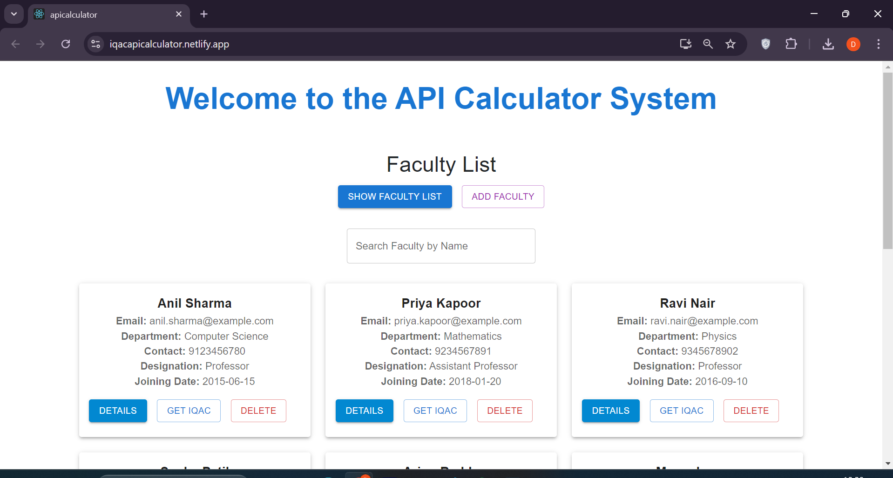

# Faculty IQAC Score Calculator

This is a full-stack web application built using **Spring Boot** for the backend and **React** for the frontend. The application allows the user to add faculty personal details and achievements through a form. Once the details are submitted, the backend calculates the faculty's **IQAC (Internal Quality Assurance Cell) Score** based on the entered data and generates a **PDF feedback** containing the score and a summary.

## Features

- **Faculty Personal Details Form**: Allows users to add details like name, email, contact, department, designation, etc.
- **Achievements Form**: Allows faculty members to enter their achievements, which are considered for calculating the IQAC score.
- **IQAC Score Calculation**: Based on the data entered, the server calculates the IQAC score.
- **PDF Feedback**: The backend generates a PDF document with the IQAC score and a detailed feedback summary.
- **Frontend and Backend Integration**: The frontend is built with React and communicates with the Spring Boot backend through RESTful APIs.

## Technologies Used

### Backend
- **Spring Boot**: For the backend API development.
- **Spring Data JPA**: For database interactions.


### Frontend
- **React**: For building the user interface.
- **Material-UI**: For UI components like forms, buttons, grids, etc.
- **Axios**: For making HTTP requests from the React frontend to the Spring 
Boot backend.
- **PDF Generation**: Libraries like jspdf for generating PDF feedback.


### Database
- **MySQL/PostgreSQL**: For storing faculty data and their achievements.

## Getting Started

### Prerequisites

1. **Node.js**: Ensure Node.js and npm are installed.
   - Install [Node.js](https://nodejs.org/).
2. **Java JDK**: Ensure Java (JDK 11 or above) is installed.
   - Install [Java](https://www.oracle.com/java/technologies/javase-jdk11-downloads.html).
3. **Maven**: For building and running the Spring Boot application.
   - Install [Maven](https://maven.apache.org/download.cgi).
4. **MySQL/PostgreSQL**: For the database, you can use MySQL or PostgreSQL (make sure it’s running).

### Setting Up the Backend (Spring Boot)

1. Clone the repository:

    ```bash
    git clone https://github.com/your-username/your-repo-name.git
    ```

2. Navigate to the backend folder:

    ```bash
    cd backend
    ```

3. Update the `application.properties` file with your database credentials:

    ```properties
    spring.datasource.url=jdbc:mysql://localhost:3306/faculty_db
    spring.datasource.username=root
    spring.datasource.password=yourpassword
    ```

4. Build and run the Spring Boot application:

    ```bash
    mvn clean install
    mvn spring-boot:run
    ```

    The backend server will start on `http://localhost:8080`.

### Setting Up the Frontend (React)

1. Navigate to the frontend directory:

    ```bash
    cd frontend
    ```

2. Install the required npm packages:

    ```bash
    npm install
    ```

3. Start the React development server:

    ```bash
    npm start
    ```

    The frontend will be available at `http://localhost:3000`.

## Running in Production

1. Build the React app for production:

    ```bash
    npm run build
    ```

2. Copy the contents of the `build/` directory into the `src/main/resources/static/` folder of your Spring Boot project.

3. Build and run the Spring Boot project again to serve both the backend and frontend from a single application:

    ```bash
    mvn clean install
    mvn spring-boot:run
    ```

4. Your application should now be live at `http://localhost:8080`.

## Contributing

1. Fork the repository.
2. Create a new branch (`git checkout -b feature-name`).
3. Make your changes.
4. Commit your changes (`git commit -am 'Add feature'`).
5. Push to the branch (`git push origin feature-name`).
6. Create a new pull request.